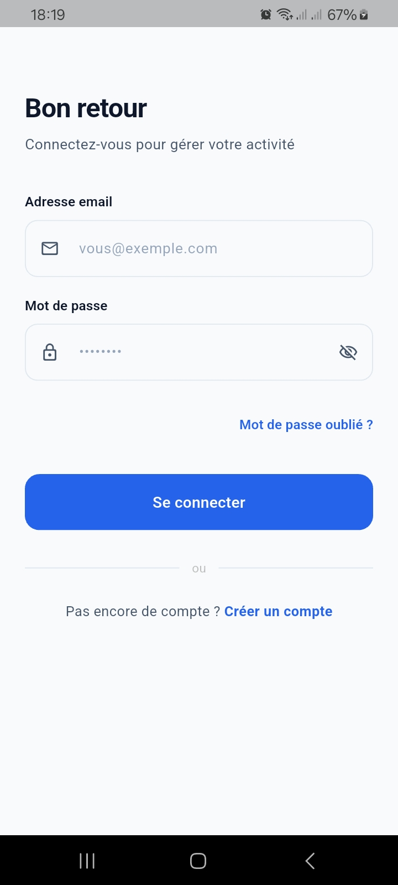
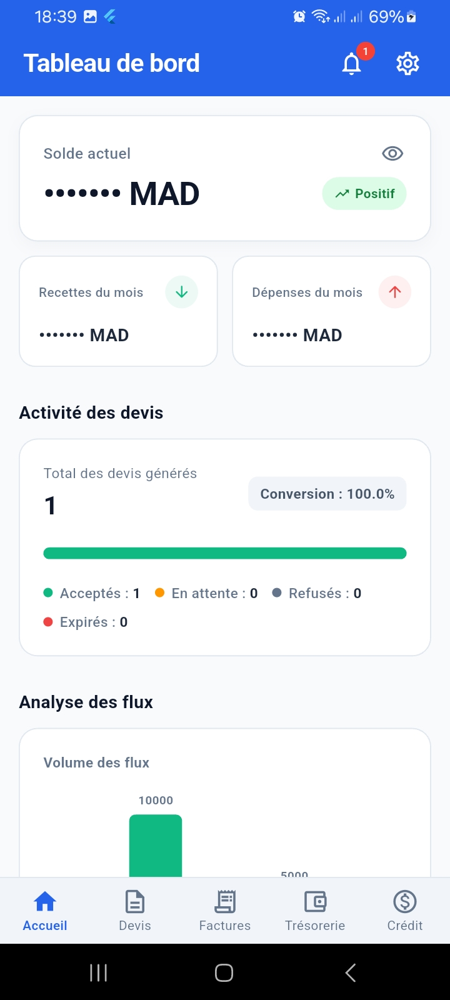
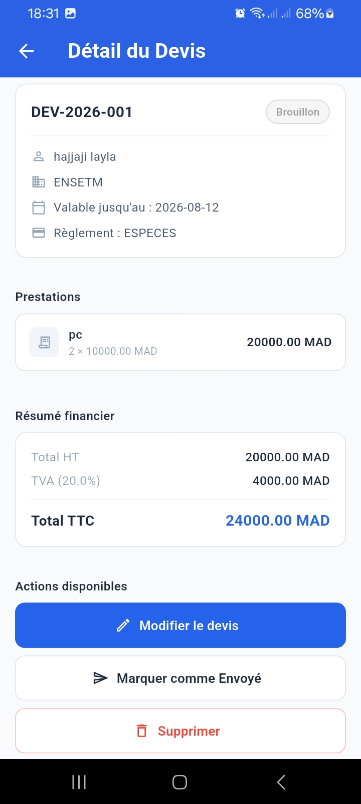
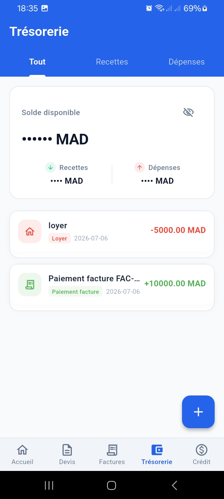

# TPE Manager — Mobile

Flutter mobile app for managing small Moroccan businesses and self-employed entrepreneurs: quotes, invoices, cash flow, credit scoring, and real-time notifications. This app communicates with the [Django REST Framework backend](https://github.com/fatima-aitoulahyan/tpe-manager-backend) of the same project.

## Table of contents

- [Preview](#preview)
- [Features](#features)
- [Tech stack](#tech-stack)
- [Architecture](#architecture)
- [Installation](#installation)
- [Configuration](#configuration)
- [Running the project](#running-the-project)
- [Project structure](#project-structure)

## Preview

| Login | Dashboard | Quotes | Credit score |
|---|---|---|---|
|  |  |  |  |

## Features

- **Authentication** — login, sign up, forgot password (email code), secure JWT token handling
- **Dashboard** — key metrics visualized through charts (`fl_chart`)
- **Quotes** — creation, editing, full lifecycle tracking (Draft → Sent → Accepted / Rejected / Expired)
- **Invoices** — creation, payment status tracking, PDF generation and export
- **Cash flow** — transaction and cash flow tracking
- **Credit** — credit eligibility score (custom visual gauge) and request tracking
- **Notifications** — real-time push notifications (Firebase Cloud Messaging) with contextual navigation, in-app notification history
- **Profile & Settings** — account configuration, including personal email setup for sending client reminders

## Tech stack

| Component | Technology |
|---|---|
| Framework | Flutter |
| State management | `flutter_bloc` (BLoC pattern) |
| Navigation | `go_router` |
| HTTP requests | `dio` |
| Secure storage | `flutter_secure_storage` |
| Push notifications | `firebase_messaging` + `flutter_local_notifications` |
| Charts | `fl_chart` |
| Environment variables | `flutter_dotenv` |
| Dependency injection | `get_it` |
| Internationalization | `flutter_localizations` / `intl` (French, Arabic) |

## Architecture

The project follows a feature-first architecture, with data / presentation layer separation:

```
lib/
├── core/
│   └── network/          # Dio client, JWT interceptors
├── features/
│   ├── auth/             # Authentication (login, register, forgot password)
│   ├── dashboard/        # Dashboard
│   ├── devis/             # Quotes management
│   ├── factures/          # Invoices management
│   ├── cashflow/          # Cash flow
│   ├── credit/             # Credit scoring and requests
│   ├── notifications/     # In-app notifications
│   └── profile/            # Profile and settings
├── routes/
│   └── app_router.dart    # GoRouter configuration
├── shared/                 # Shared widgets and pages
└── main.dart
```

Each feature generally follows this structure:

```
feature/
├── data/
│   └── datasources/      # API calls (Dio)
├── presentation/
│   ├── bloc/               # Bloc, Events, States
│   ├── pages/               # Screens
│   └── widgets/              # Reusable components
```

## Installation

### Prerequisites

- [Flutter SDK](https://docs.flutter.dev/get-started/install) (^3.12.0)
- A Firebase account with a configured project (for push notifications)
- The [TPE Manager backend](https://github.com/fatima-aitoulahyan/tpe-manager-backend) running and reachable

### Clone the project

```bash
git clone https://github.com/fatima-aitoulahyan/tpe-manager-mobile.git
cd tpe-manager-mobile
```

### Install dependencies

```bash
flutter pub get
```

## Configuration

### Environment variables

1. Copy the example file:

```bash
cp .env.example .env
```

2. Set the backend API URL in `.env`:

```env
BASE_URL=http://192.168.8.4:8000/api
```

> 💡 Replace the IP address with the one of the machine hosting the backend if you're testing on a physical device (not an emulator) — the device must be on the same local network as the server.

### Firebase (push notifications)

1. Create a project on the [Firebase console](https://console.firebase.google.com/)
2. Add an Android app to the project
3. Download the generated `google-services.json` file
4. Place it in `android/app/google-services.json`

> ⚠️ The `.env` and `google-services.json` files contain environment-specific sensitive information and are not versioned (see `.gitignore`).

## Running the project

Check that a device or emulator is detected:

```bash
flutter devices
```

Run the app:

```bash
flutter run
```

Build an Android release version:

```bash
flutter build apk --release
```

## Project structure

```
tpe_mobile/
├── android/               # Native Android configuration
├── ios/                   # Native iOS configuration
├── lib/                   # Dart source code
├── test/                  # Tests
├── docs/
│   └── screenshots/       # App screenshots used in this README
├── .env.example           # Example configuration
├── pubspec.yaml           # Project dependencies
└── analysis_options.yaml  # Lint rules
```

## License

This project is distributed under the MIT License.

## Author

Built as a final-year project (PFA) — GLSID, ENSET Mohammedia.
